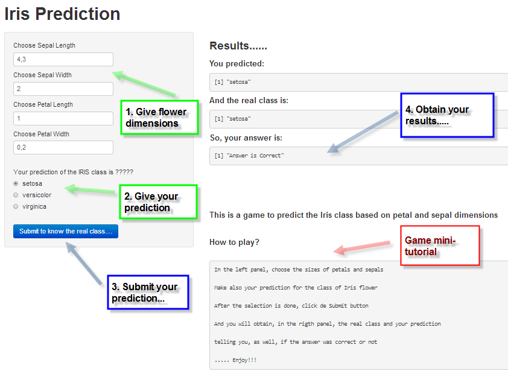

Presentation of the Iris Prediction application
========================================================
author: Manuel Lopez
date: August 2014

Iris prediction game - Introduction
========================================================

The application **Iris prediction** is an application in a game form.

The application allows the user to select:
- Petal and sepal dimensions
- The class of iris flower (virginica, setosa,..) prediction from the user

The application provides:
- The real iris class
- If the class prediction from the user was correct or wrong

Game front-end and example
========================================================



Game internals
========================================================
The prediction algorithm used to obtained the real iris class is a neural network (one hidden layer of 10 units) using the iris data.

Using a 80-20% split between training and testing sets, the accuracy obtained over the test set is 93.3%.


```r
table(true=test$Species, predicted=predict(model_nnet, test, type="class"))
```

```
            predicted
true         setosa versicolor virginica
  setosa          8          0         0
  versicolor      1          8         0
  virginica       0          1        12
```

Where to obtain the game.....
========================================================

To obtain the game go to this link:


- [link to play the game....](http://mlopezm.shinyapps.io/IrisPrediction/)


**Enjoy.....**

